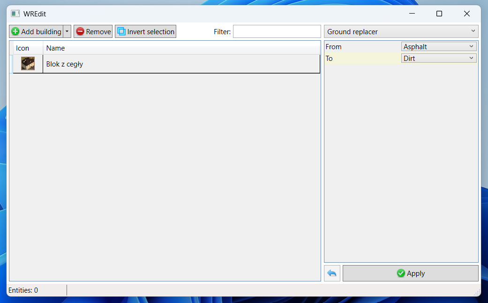
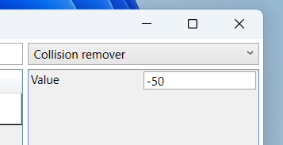
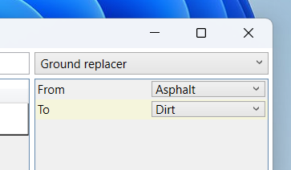

# WREdit

WREdit is a modular program for batch editing buildings in Workers & Resources: Soviet Republic.



## Features

### Collision remover

\
Removes collisions from buildings by adding the $HARBOR_EXTEND_AREA_WHEN_BULDING tag to the building definition file.

### Ground replacer

\
Modifies the ground texture beneath the buildings while preserving its shape. To remove the texture, set the "To" property to "None".

## Extending WREdit

WREdit was designed to be modular and easily extendible.

### Creating a new WREdit extension

WREdit extensions are written in C#. To add a new feature, create a new class library and reference the WREdit.Base.dll.

### Creating a new entity processor

To create a new entity processor, create a new class and implement the IEntityProcessor interface. You can also mark it with EntityProcessor attribute to specify a more user friendly name.

```csharp
[EntityProcessor(DisplayName = "My extension")]
class MyExtension : IEntityProcessor
{
    public void Execute(IEntity entity)
    {
        //Process the entity...
    }

    public void RegisterProperties(ICollection<IProcessorProperty> properties) {
        //Specify processor's properties
    }
}
```

### Adding properties

Sometimes you might want to expose some properties to the users to customize the behaviour of the processor. The best way to do that is to just add a regular property to your extension class and mark it with the `[Property]` attribute. You can also do that manually in the `RegisterProperties` method.

```csharp
class MyExtension : IEntityProcessor
{
    [Property]
    public int Value { get; set; }

    //This property will appear as 'Custom Name' and will include a tooltip "Tooltip".
    [Property(DisplayName = "Custom name", Help = "Tooltip")]
    public int NamedValue { get; set; }
}
```

Currently WREdit supports the following property types:

- bool
- byte
- sbyte
- short
- ushort
- int
- uint
- long
- ulong
- float
- double
- string
- enum

More types can be added by extending `ProcessorProperty` class and providing a WPF PropertyTemplate.

### Processing entities

Processing entities happens in the `Execute` method. To modify an entity, select its property, then append or prepend a new one or remove it.

#### Selection

```csharp
entity.SelectNextProperty("$TAG_NAME type:name ...");
```

Example: selecting name id

```csharp
var nameProperty = entity.SelectNextProperty("$NAME number:name_id");
var nameId = nameProperty?.GetValue<int>("name_id");
//or nameProperty?.GetValue<int>(0) to get the first parameter.

//For residential_brick_1.ini: 6001
Console.WriteLine(nameId);
```

#### Addition

```csharp
//Adds specified text after the selected property
entity.Append("$HARBOR_EXTEND_AREA_WHEN_BULDING -50");

//Adds specified text before the selected property
entity.Prepend("$HARBOR_EXTEND_AREA_WHEN_BULDING -50");
```

#### Removal

```csharp
//Removes selected property
entity.RemoveSelection();
```

### Full example: Collision remover

```csharp
[EntityProcessor(DisplayName = "Collision remover")]
internal class CollisionRemover : IEntityProcessor
{
    [Property(DisplayName = "Value")]
    public short Value { get; set; } = -50;

    public void Execute(IEntity entity)
    {
        //Get existing property
        var existingProperty = entity.SelectNextProperty("$HARBOR_EXTEND_AREA_WHEN_BULDING number");

        if (existingProperty is null)
        {
            //If the property doesn't exist just add a new one
            entity.Append($"$HARBOR_EXTEND_AREA_WHEN_BULDING {Value}");
        }
        else if (existingProperty?.GetValue<short>(0) != Value)
        {
            //If the property exists and has a different value, remove it and add a new one.
            entity.RemoveSelection();
            entity.Append($"$HARBOR_EXTEND_AREA_WHEN_BULDING {Value}");
        }
    }

    public void RegisterProperties(ICollection<IProcessorProperty> properties) { }
}
```
